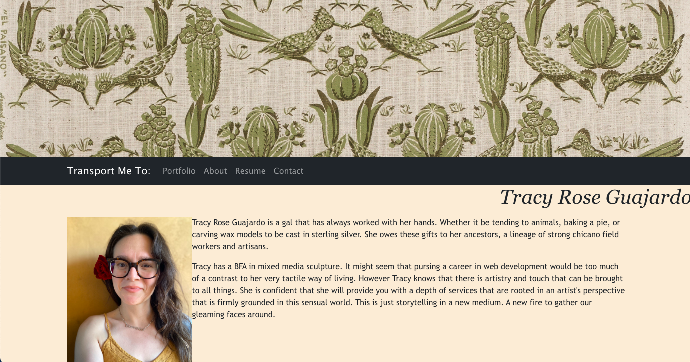

# TRG React Portfolio
  

## Description
Welcome to my portfolio! I have used React.js to build out a dynamic application with reusable components that can be injected into the different views. Each page has a header, a footer, and a place for the main content. Here you can read all about me, send me a message, and most importantly view some of my projects with links to their deployed applications and to the Github repositories. Thank you for taking a look.

## Table of Contents
- [Installation](#installation)
- [Usage](#usage)
- [License](#license)
- [Contributing](#contributing)
- [Tests](#tests)
- [Questions](#questions)
- [Visuals](#visuals)

## Installation

There is no installation necessary with this application.

## Usage

Simply follow the link to the deployed application and enjoy clicking around.

## License
  
  This project uses the Mozilla_Public_License_2.0 license. 
  **If you have questions on the license please check the following site [choose a license](https://www.google.com)

## Contributing

Since this is my personal portfolio I am not accepting direct collaboration. However I would love to hear your feedback and suggestions; send me an email!

## Tests

There is no testing in place for this application.

## Questions

Please feel free to explore my other projects on github: [tracyroseguajardo](https://www.github.com/tracyroseguajardo)

If you have further questions you may send me an email at: tracyroseguajardo@gmail.com

## Visuals

Link to deployed application:
[TRG Portfolio](https://lit-beyond-54863.herokuapp.com/)

Screenshot of application:

Link to github repository:
[TRG React Portfolio](https://github.com/tracyroseguajardo/my-dev-portfolio)